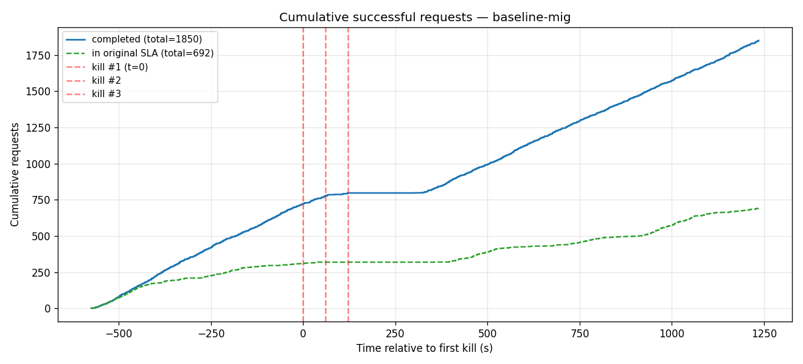
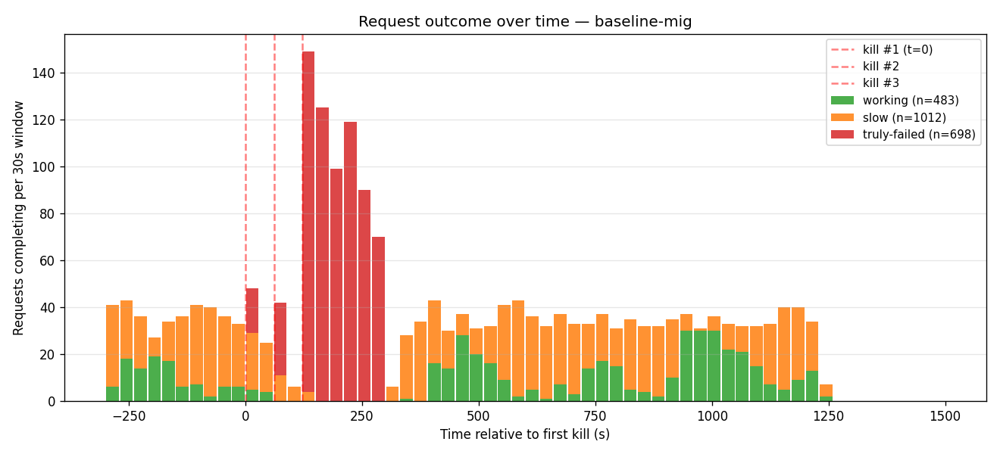
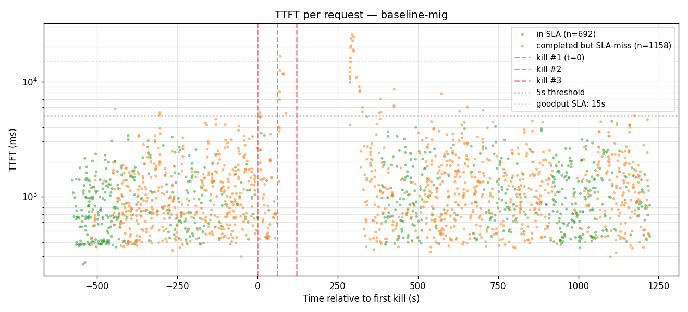
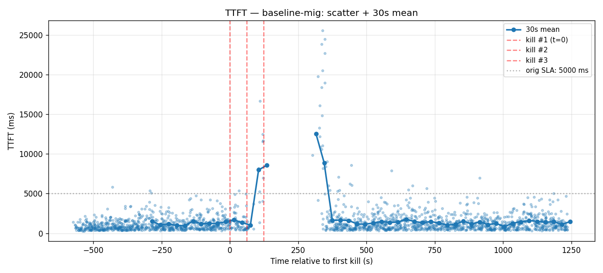
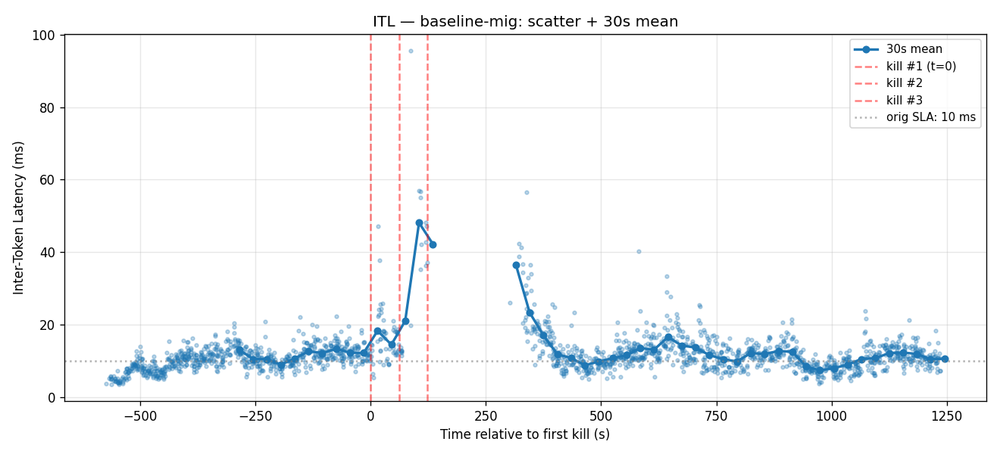
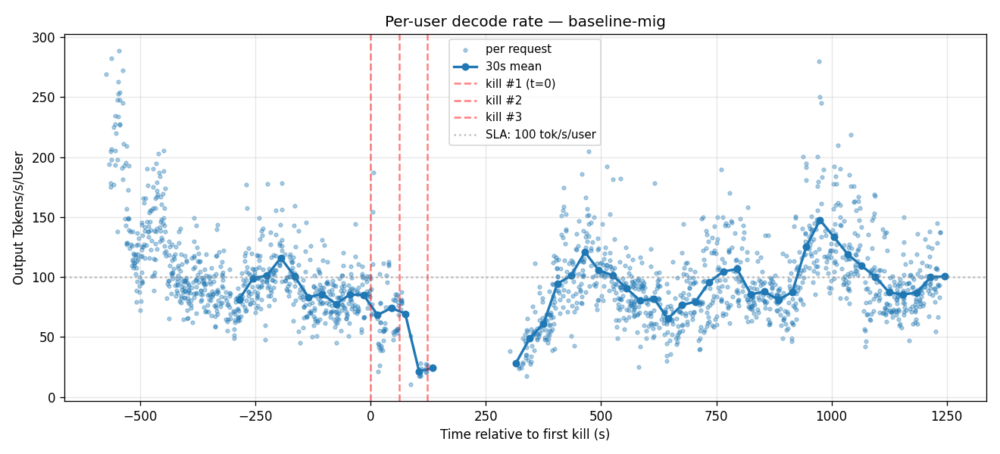

# Baseline + request-migration 3× cascade

3-worker baseline (no failover surface) with **frontend request migration enabled** (`--migration-limit 10`). Three workers killed 60 s apart. Migration silently retries mid-stream disconnects against any other healthy worker by re-prefilling (original prompt + tokens already streamed).

- **Date**: 2026-05-02
- **Cluster**: nv-prd-dgxc nscale, 3 × B200 (tep8x1 each)
- **Workers**: 3 replicas spread across DRA nodes `tx5tk`, `d6dn5`, `s2877`
- **Image**: `dynamoci.azurecr.io/ai-dynamo/dynamo:failover-v2-675ae24fe21-trtllm-runtime` (TRT-LLM rc11, gms-refactor, **failover surface OFF**)
- **Frontend flag**: `--migration-limit 10` — confirmed via startup log: `"Request migration enabled (limit: 10)"`
- **Engine config**: same as plain baseline (graphs `[1,2,4,8,16,32,64,128]+padding`, autotuner on, chunked_prefill on, `max_batch=128`, `fp8 KV`, EAGLE3, `moe_config.backend: TRTLLM`)
- **Trace + aiperf**: identical to other runs

## Cascade timeline

| Event | Wall-clock | Pod | Node |
|---|---|---|---|
| aiperf start | 00:01:39Z (May 2) | — | — |
| Kill #1 (T+600 s) | 00:11:39Z | `kimi-baseline-mig-3x-0-trtllmworker-fvdl5` | tx5tk |
| Kill #2 (T+660 s) | 00:12:40Z | `kimi-baseline-mig-3x-0-trtllmworker-sqhmz` | d6dn5 |
| Kill #3 (T+720 s) | 00:13:41Z | `kimi-baseline-mig-3x-0-trtllmworker-zm5rr` | s2877 |
| aiperf wraps | 00:31:54Z | — | — |

## Headline numbers

| | Value |
|---|---|
| Total HTTP requests issued | 2,548 |
| Completed (HTTP 200) | 1,850 |
| Truly failed | **698** (27%) |
| Met original SLA (TTFT≤5s, ITL≤10ms) | 692 (27%) |
| Slow but completed | 1,158 (45%) |
| Met relaxed goodput (TTFT≤15s, ITL≤30ms) | 1,821 (98% of completions) |

### First successful response after each kill

| | First HTTP 200 (any) | First in-SLA |
|---|---|---|
| Kill #1 (t=0)        | +1.46 s | +4.58 s |
| Kill #2 (t=+61 s)    | +2.15 s | **+295 s** (~5 min) |
| Kill #3 (t=+123 s)   | +2.11 s | **+233 s** (~4 min) |

## Charts

### Cumulative successful requests

### Request outcome over time
A sustained red wall through the cascade window — but extending slightly *more* in time than plain baseline. The retries pile additional work on dying workers and on each other.

### TTFT scatter

### TTFT — 30 s mean

### ITL — 30 s mean

### Per-user decode rate

## Notes

- **Why migration alone barely helps**: each migration costs a full prefill on the new worker. When *all 3* workers are down (the +120 s → +300 s cascade window), every retry hits another dead worker and consumes a slot in the migration-limit budget. After 10 failed retries, migration gives up and surfaces the failure to the client. So mid-cascade failures still propagate to the user — migration only protects against *transient* single-worker outages, not synchronized cascading ones.
- **Recovery is ~2 minutes faster than plain baseline** (+295 s vs +433 s for kill #2; +233 s vs +372 s for kill #3). That's because once one worker comes back online, in-flight requests that were churning through migration retries can land on the recovered worker without waiting for aiperf to dispatch a fresh request.
- **Slightly more total dispatches than baseline** (2,548 vs 2,439) — migration frees aiperf credits faster (failed requests resolve in seconds via retry exhaustion rather than hanging on dead TCP connections), so more new dispatches get to be attempted during the disruption.
- **`first_http_200_after_kill` for kills 2 and 3** is a `truly-failed` response with `osl=null`. That's a migration-stream that returned a 200 status header to the client and emitted some chunks before the underlying retries exhausted. Migration cannot un-emit headers — it can only swallow the underlying disconnect — so a stream that has already emitted some chunks but then can't recover surfaces as a partial 200 with truncation. (We classify these as truly-failed because `osl is None AND chunks > 5`.)

Raw artifacts (per-request records, kill plans, run logs, etc.) are kept on the internal benchmark branch.
