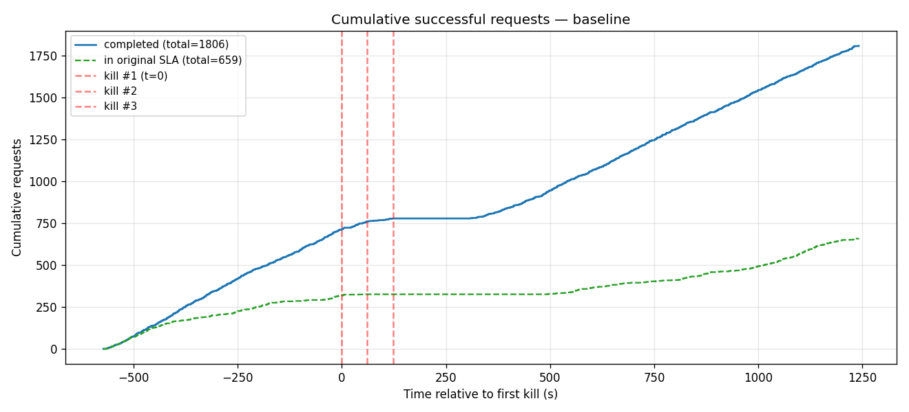
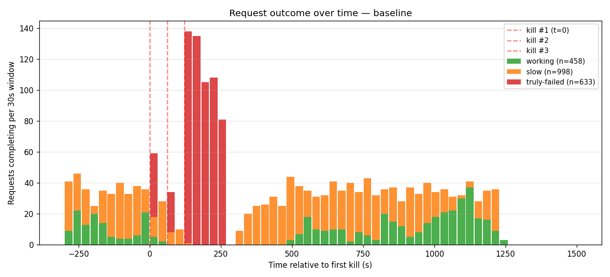
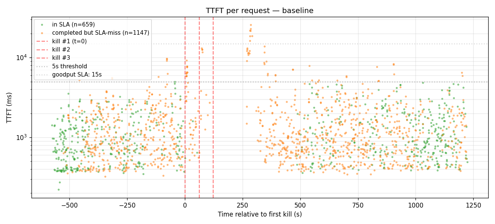
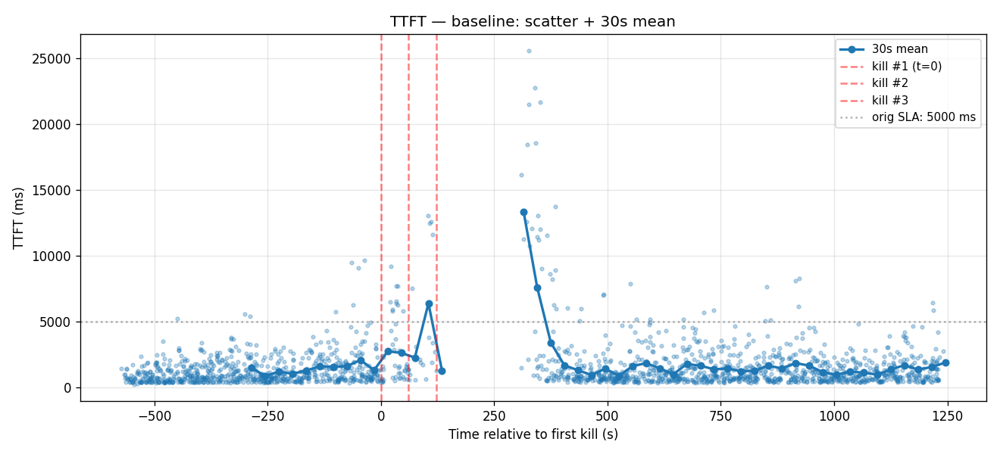
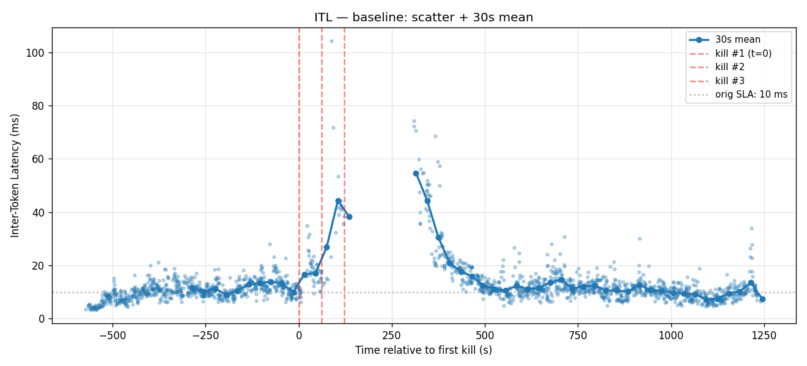
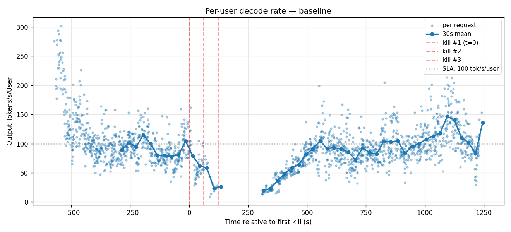

# Baseline 3× cascade

3-worker baseline (no failover, plain TRT-LLM aggregated serving), with three workers killed 60 s apart. Recovery is whatever Kubernetes does when the container exits and restartPolicy fires.

- **Date**: 2026-05-01
- **Cluster**: nv-prd-dgxc nscale, 3 × B200 (tep8x1 each)
- **Workers**: 3 replicas spread across DRA nodes `s2877`, `l9nsv`, `tx5tk`
- **Image**: `dynamoci.azurecr.io/ai-dynamo/dynamo:failover-v2-675ae24fe21-trtllm-runtime` (TRT-LLM rc11, gms-refactor, failover surface OFF)
- **Engine config**: graphs `[1,2,4,8,16,32,64,128]+padding`, autotuner on, chunked_prefill on, overlap on, `max_batch=128`, `fp8 KV`, `free_gpu_memory_fraction=0.75`, EAGLE3 spec decode, **`moe_config.backend: TRTLLM`** (matched to failover deployment)
- **Trace**: `kv-reuse-difficult_200k-fixed/dataset.jsonl` mooncake-trace replay via aiperf 0.7.0
- **aiperf**: `--concurrency 24 --benchmark-duration 1800 --concurrency-ramp-duration 60 --goodput "time_to_first_token:15000 inter_token_latency:30"` (3× the original SLAs to widen the goodput band)

## Cascade timeline

| Event | Wall-clock | Pod | Node |
|---|---|---|---|
| aiperf start | 21:16:07Z | — | — |
| Kill #1 (T+600 s) | 21:26:09Z | `kimi-baseline-3x-0-trtllmworker-6g8t4` | s2877 |
| Kill #2 (T+660 s) | 21:27:10Z | `kimi-baseline-3x-0-trtllmworker-ckfrj` | l9nsv |
| Kill #3 (T+720 s) | 21:28:11Z | `kimi-baseline-3x-0-trtllmworker-tp9dd` | tx5tk |
| aiperf wraps | 21:46:24Z | — | — |

Kill recipe: `kubectl exec -- kill -9 $(pgrep -f "orted|mpi4py.futures.server")` against the worker pod's `main` container. MPI children dying cascades to parent python via `MPI_ABORT`, container exits, K8s restarts (~5 min cold-start to re-load engine + EAGLE3 head + warm graphs).

## Headline numbers

| | Value |
|---|---|
| Total HTTP requests issued | 2,439 |
| Completed (HTTP 200) | 1,806 |
| Truly failed (HTTP non-200 / truncated / no completion) | **633** (26%) |
| Met original SLA (TTFT≤5s, ITL≤10ms) | **659** (27%) |
| Completed but slow (200 OK, missed original SLA) | **1,147** (47%) |
| Met relaxed goodput (TTFT≤15s, ITL≤30ms) | 1,751 (97% of completions) |
| Pre-kill TTFT p50 | ~750 ms |
| Pre-kill ITL avg | ~9 ms |
| Run-wide TTFT avg | 1,548 ms |
| Run-wide ITL avg | 12.45 ms |
| Run-wide tok/s/user avg | 96.5 |

### First successful response after each kill

"Working" = HTTP 200 + non-empty stream regardless of SLA. "In SLA" = working AND met the original `5s/10ms` thresholds.

| | First HTTP 200 (any) | First in-SLA |
|---|---|---|
| Kill #1 (t=0)        | +0.52 s (a request mid-stream) | +2.86 s |
| Kill #2 (t=+61 s)    | +0.38 s | **+433 s** (~7 min) |
| Kill #3 (t=+123 s)   | +0.25 s | **+372 s** (~6 min) |

The "first 200 within 1 s of each kill" is misleading — those are pre-kill in-flight requests whose stream hadn't been disturbed because they were on a different worker than the one being killed. The honest recovery measure is **first in-SLA after each kill**, which is the moment the system as a whole resumes serving at quality.

After kill #2, that's 7 minutes. After kill #3 (all 3 workers down), it's 6 minutes — and notably the same `e3acf12d` request that satisfied kill #2's recovery also satisfied kill #3's, because the system stayed below SLA continuously through both events.

## Charts

### Cumulative successful requests
Steady climb pre-kill in both classes, flat (or near-flat) for ~5 min through the cascade window, then a slow climb resumes from ~T+300s onward.

### Request outcome over time
The clearest narrative chart: a steady green/orange mix pre-kill, a *cliff of red* spanning the 5-minute cascade window (T=0 → T=+300 s), then completions come back. Note the visible gap around T=+300 s — that's the moment when **zero completions** are happening because all 3 workers are still in restart loop.

### TTFT scatter
Per-request TTFT (log scale). Red dots fill the kill window. Post-recovery scatter resumes around its pre-kill range (~700 ms p50) but with elevated variance.

### TTFT — 30 s mean
Pre-kill mean hovers near 1 s; post-kill spikes well above the goodput SLA (15 s) for ~4–5 min before settling back.

### ITL — 30 s mean
Pre-kill mean hovers around the 10 ms SLA boundary (ITL drift at c=24 saturation, same dynamic as the c=8 demo). Post-kill spikes briefly to 50–100 ms before recovering.

### Per-user decode rate
Pre-kill: ~80–110 tok/s/user (around the SLA threshold of 100). Cascade window: blackout. Post-recovery: scatter resumes near the SLA line.

## Notes

- **Why so many "slow"**: at c=24, even pre-kill the engine is at the edge of saturation — ITL drifts past 10 ms and TTFT past 5 s for many requests. The relaxed `15 s / 30 ms` goodput SLA captures 97% of completions. Compare against the failover run (same load, same SLA) for the apples-to-apples comparison.
- **Why kill #1's "first 200" is at +0.52 s**: that request was in-flight on a *different* worker than the one we killed. With 3 workers absorbing c24, only ~1/3 of credits were on the killed worker's queue at any given moment — others continued completing through the kill instant.
- **The 6–7 min recovery**: K8s restarts the container, which has to reload the model from disk (NVFP4 + EAGLE3 head ~50 GB), JIT-compile flashinfer kernels, and warm the graph ladder. The image was already cached on these nodes (the slowest part of the very first deploy was the image pull on the fresh `tx5tk` node).
- **`moe_config.backend: TRTLLM`** (not CUTLASS) — matched to failover's required setting, since CUTLASS breaks the standby's GMS materialize path.

Raw artifacts (per-request records, kill plans, run logs, etc.) are kept on the internal benchmark branch.
