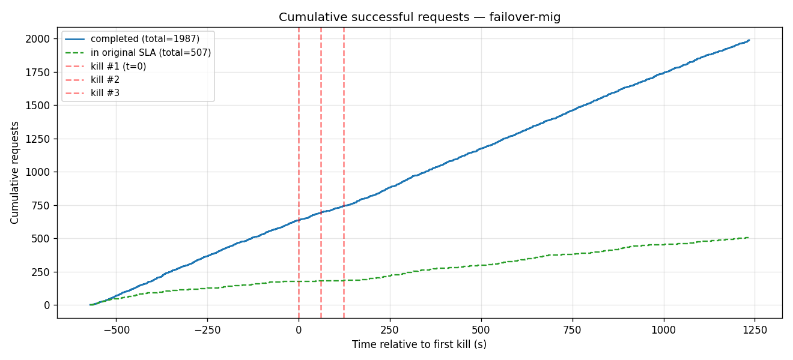
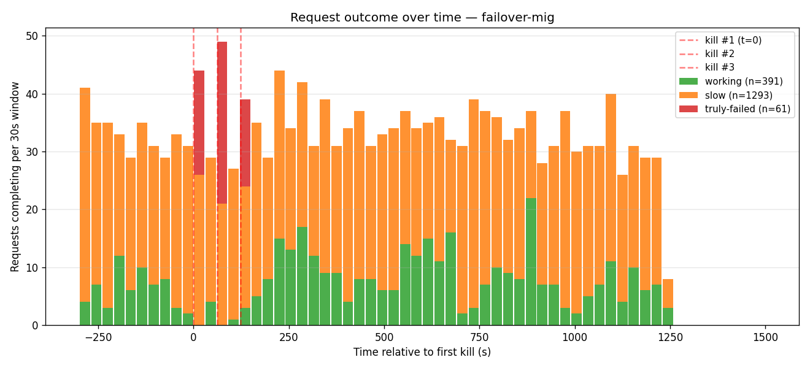
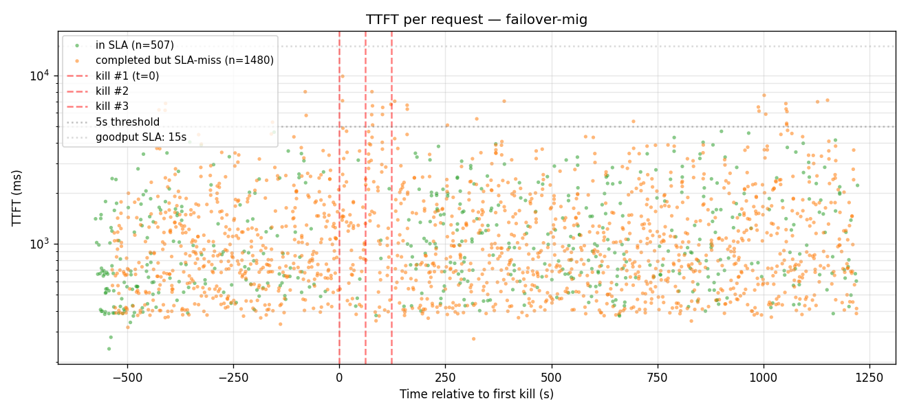
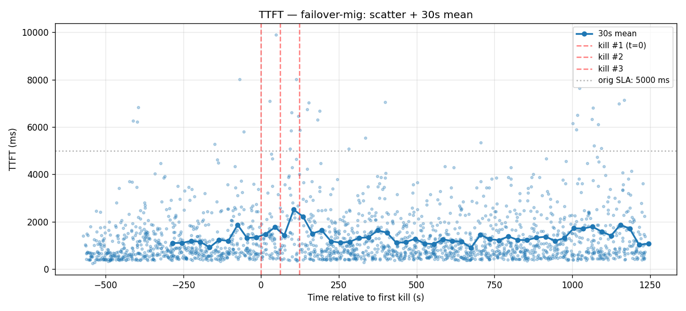
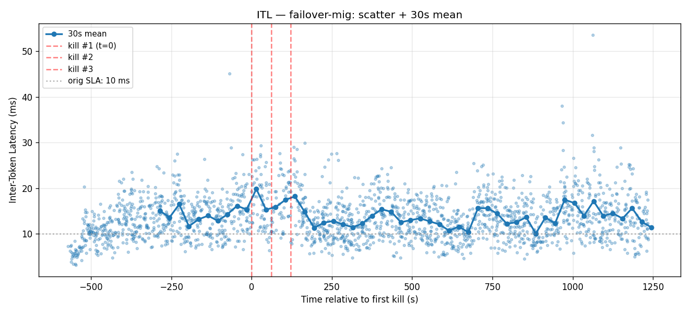
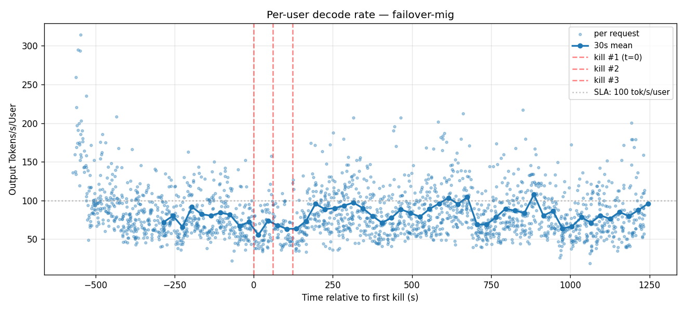

# Failover + request-migration 3× cascade

3-worker GMS shadow-failover (PR #8572) **plus** frontend request migration (`--migration-limit 10`). Both belt and suspenders: failover handles the engine-side handoff, migration silently retries any client-visible disconnect.

- **Date**: 2026-05-02
- **Cluster**: nv-prd-dgxc nscale, 3 × B200 (tep8x1 each)
- **Workers**: 3 replicas spread across DRA nodes `l9nsv`, `d6dn5`, `s2877`
- **Image**: `dynamoci.azurecr.io/ai-dynamo/dynamo:failover-v2-675ae24fe21-trtllm-runtime`
- **Failover surface ON** (`--gms-shadow-mode --load-format gms`)
- **Frontend flag**: `--migration-limit 10` — confirmed via startup log: `"Request migration enabled (limit: 10)"`
- **Engine config**: same as plain failover (TRTLLM MoE backend required for GMS materialize, EAGLE3 spec decode, fp8 KV)

## Cascade timeline

| Event | Wall-clock | Pod | Node |
|---|---|---|---|
| aiperf start | 01:24:08Z | — | — |
| Kill #1 (T+600 s) | 01:34:08Z | `kimi-failover-mig-3x-0-trtllmworker-rv6m6` (engine-0) | l9nsv |
| Kill #2 (T+660 s) | 01:35:10Z | `kimi-failover-mig-3x-0-trtllmworker-tkpz9` (engine-0) | d6dn5 |
| Kill #3 (T+720 s) | 01:36:11Z | `kimi-failover-mig-3x-0-trtllmworker-tlxf6` (engine-0) | s2877 |
| aiperf wraps | 01:54:21Z | — | — |

## Headline numbers

| | Value |
|---|---|
| Total HTTP requests issued | 2,048 |
| Completed (HTTP 200) | 1,987 |
| Truly failed | **61** (3%) — best of all 4 setups |
| Met original SLA (TTFT≤5s, ITL≤10ms) | 507 (25%) |
| Slow but completed | 1,480 (72%) |
| Met relaxed goodput (TTFT≤15s, ITL≤30ms) | 1,982 (>99% of completions) |

### First successful response after each kill

| | First HTTP 200 (any) | First in-SLA |
|---|---|---|
| Kill #1 (t=0)        | +0.78 s | +47.3 s |
| Kill #2 (t=+61 s)    | +0.005 s (5 ms!) | +29.5 s |
| Kill #3 (t=+123 s)   | +1.47 s | +3.4 s |

The "first in-SLA" times for kills #1 and #2 look worse than failover-only because migration redirected the would-be-failed requests into the slow category instead. The first 200 (any) is sub-second for all three kills — meaning the system never goes silent. The first in-SLA time is essentially when "a small request that didn't need migration" arrives in the post-kill window — that's stochastic, not a system property.

## Charts

### Cumulative successful requests

### Request outcome over time
The smallest red bars of all 4 setups. Three thin spikes exactly at the kill moments and continuous green/orange throughout — the cleanest cascade-resilience picture.

### TTFT scatter

### TTFT — 30 s mean

### ITL — 30 s mean

### Per-user decode rate

## Notes

- **Why failover+mig beats failover-only by 28 errors (61 vs 89)**: the residual NATS subscriber transition window during engine-1 promotion still exists, but instead of surfacing as a 500 to the client, those few hundred-ms gaps now trigger frontend migration which retries on a different already-promoted worker. The failures only break through to the user when migration also exhausts its 10 retries.
- **Why "slow" is up vs failover-only (72% vs 71%)**: migration retries that succeed cost a re-prefill on the new worker, which adds 1–4 s to the request's TTFT. Those additional latency contributions push more requests above 5 s.
- **Composability**: `failover` is the engine-side mechanism (KV cache + engine state preserved across the handoff). `migration` is the frontend-side mechanism (transparent retry on any disconnect). They address different failure modes and stack cleanly: failover absorbs the engine-down-but-replaceable case, migration absorbs the in-flight-stream-disconnected case. Neither alone covers everything, both together cover almost everything we threw at this cascade test.

Raw artifacts (per-request records, kill plans, run logs, etc.) are kept on the internal benchmark branch.
