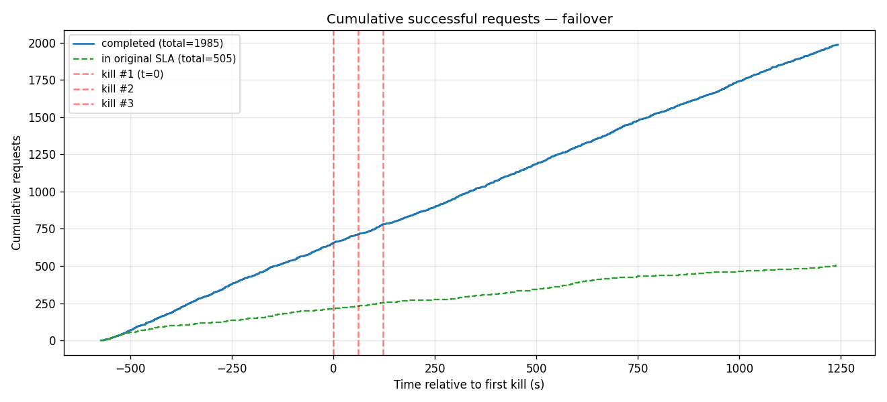
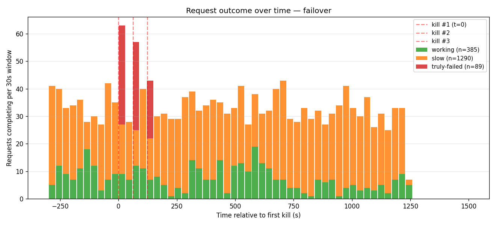
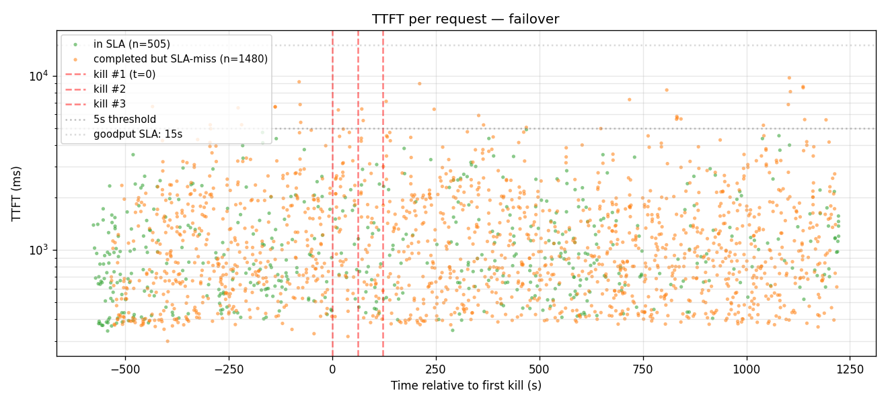
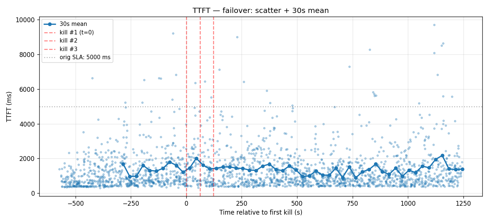
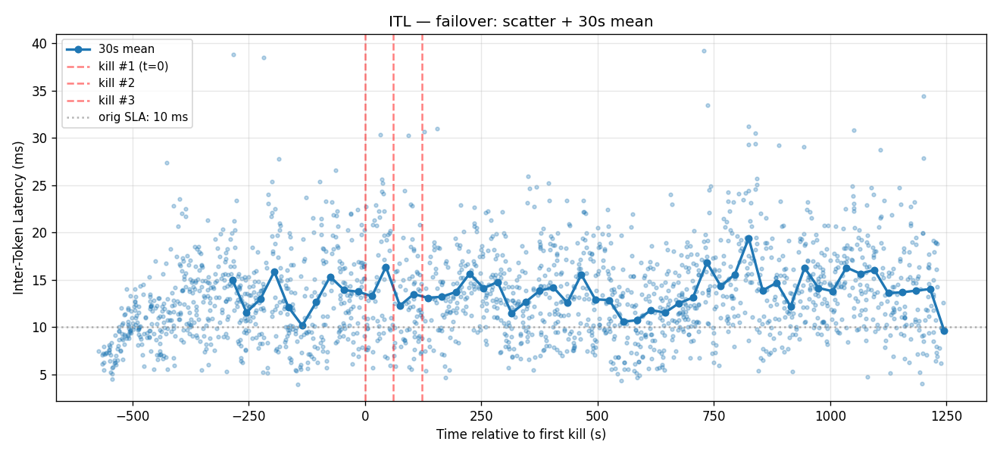
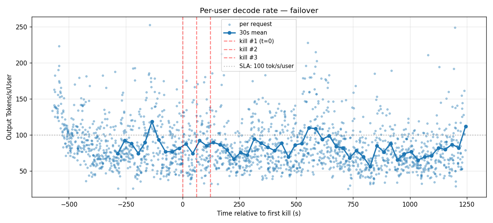

# Failover 3× cascade

3-worker GMS shadow-failover (PR #8572), with three workers killed 60 s apart. Each kill targets `engine-0` (active primary); engine-1 (prewarmed standby) takes over.

- **Date**: 2026-05-01
- **Cluster**: nv-prd-dgxc nscale, 3 × B200 (tep8x1 each)
- **Workers**: 3 replicas spread across DRA nodes `tx5tk`, `d6dn5`, `l9nsv`
- **Image**: `dynamoci.azurecr.io/ai-dynamo/dynamo:failover-v2-675ae24fe21-trtllm-runtime` (TRT-LLM rc11, gms-refactor, **failover surface ON** with `--gms-shadow-mode --load-format gms`)
- **Engine config**: graphs `[1,2,4,8,16,32,64,128]+padding`, autotuner on, chunked_prefill on, overlap on, `max_batch=128`, `fp8 KV`, `free_gpu_memory_fraction=0.75`, EAGLE3 spec decode, **`moe_config.backend: TRTLLM`** (CUTLASS path crashes the standby's GMS materialize)
- **Trace**: `kv-reuse-difficult_200k-fixed/dataset.jsonl` mooncake-trace replay via aiperf 0.7.0
- **aiperf**: same as baseline — `--concurrency 24 --benchmark-duration 1800 --concurrency-ramp-duration 60 --goodput "time_to_first_token:15000 inter_token_latency:30"`

## Cascade timeline

| Event | Wall-clock | Pod | Node |
|---|---|---|---|
| aiperf start | 22:45:20Z | — | — |
| Kill #1 (T+600 s) | 22:55:20Z | `kimi-failover-3x-0-trtllmworker-bxtmr` (engine-0) | tx5tk |
| Kill #2 (T+660 s) | 22:56:21Z | `kimi-failover-3x-0-trtllmworker-nh2zq` (engine-0) | d6dn5 |
| Kill #3 (T+720 s) | 22:57:22Z | `kimi-failover-3x-0-trtllmworker-w6crv` (engine-0) | l9nsv |
| aiperf wraps | 23:15:40Z | — | — |

Kill recipe: `kubectl exec -- kill -9 $(pgrep -f "orted|mpi4py.futures.server")` against the worker pod's `engine-0` container. MPI children dying cascades to parent python via `MPI_ABORT`, engine-0 process exits → engine-1 (prewarmed standby) acquires the lock and promotes to active primary in seconds.

## Headline numbers

| | Value |
|---|---|
| Total HTTP requests issued | 2,074 |
| Completed (HTTP 200) | 1,985 |
| Truly failed (HTTP non-200 / truncated / no completion) | **89** (4%) |
| Met original SLA (TTFT≤5s, ITL≤10ms) | **505** (24%) |
| Completed but slow (200 OK, missed original SLA) | **1,480** (71%) |
| Met relaxed goodput (TTFT≤15s, ITL≤30ms) | 1,973 (99% of completions) |
| Pre-kill TTFT p50 | ~700 ms |
| Pre-kill ITL avg | ~10 ms |
| Run-wide TTFT avg | 1,322 ms |
| Run-wide ITL avg | 13.41 ms |
| Run-wide tok/s/user avg | 84.8 |

### First successful response after each kill

"Working" = HTTP 200 + non-empty stream regardless of SLA. "In SLA" = working AND met the original `5s/10ms` thresholds.

| | First HTTP 200 (any) | First in-SLA |
|---|---|---|
| Kill #1 (t=0)        | +1.15 s | +1.43 s |
| Kill #2 (t=+61 s)    | +0.31 s | **+0.31 s** (same request) |
| Kill #3 (t=+123 s)   | +0.21 s | **+6.75 s** |

Worst-case per-kill recovery to in-SLA quality: **6.75 seconds after kill #3**. After kill #1 and kill #2, the system was serving in-SLA traffic *within 1.5 seconds* of the kill firing — meaning the standby engine was already active and decoding before aiperf could even register a meaningful gap.

## Charts

### Cumulative successful requests
The "all 3 workers down" silence pattern from baseline is gone — the failover line is essentially continuous through the cascade window.

### Request outcome over time
Three short-and-narrow red bars at exactly the kill moments (one per kill) — none of them dominate the bin. Steady green/orange completion mix continues throughout. Compare to baseline's 5-minute red wall.

### TTFT scatter
The cascade window has elevated TTFT but no blackout zone. Most requests post-kill stay below 15 s.

### TTFT — 30 s mean
30 s mean stays well-bounded through the cascade, briefly elevated in the kill window then recovering quickly.

### ITL — 30 s mean
Pre-kill mean ~10 ms (same saturation dynamic as baseline at c=24). Post-kill ITL spike is brief and mild — engine-1 promotion doesn't drain queues the way a cold pod restart does.

### Per-user decode rate
Continuous serving throughout. The cascade window does not leave a visible gap.

## Notes

- **Why 89 truly-failed (not zero)**: each engine-0 → engine-1 promotion has a brief NATS subscriber transition window (the standby's worker-subject subscriber needs to register and receive the dispatcher signal). Requests dispatched during that window get "no responders" 500s. With c=24 and 3 cascading kills, the cumulative window of bad-luck dispatches yields ~30 errors per kill.
- **Why "slow" went up vs baseline (71% vs 47%)**: with c=24 and one engine actively promoting, the surviving primaries absorb extra load briefly — driving ITL above the 10 ms threshold. The relaxed `15 s / 30 ms` goodput SLA captures 99% of completions, vs 97% for baseline.
- **Why first-in-SLA after kill #3 is +6.75 s**: that's a single request that was waiting on dispatch when kill #3 fired and its dispatch landed during the brief promotion window. Subsequent requests recovered immediately.
- **`moe_config.backend: TRTLLM`** (not CUTLASS) — required for the standby's GMS materialize path. Iter3 attempt at CUTLASS crashed with `AttributeError: 'FusedMoEQuantScalesNVFP4' object has no attribute '0'`.

Raw artifacts (per-request records, kill plans, run logs, etc.) are kept on the internal benchmark branch.
